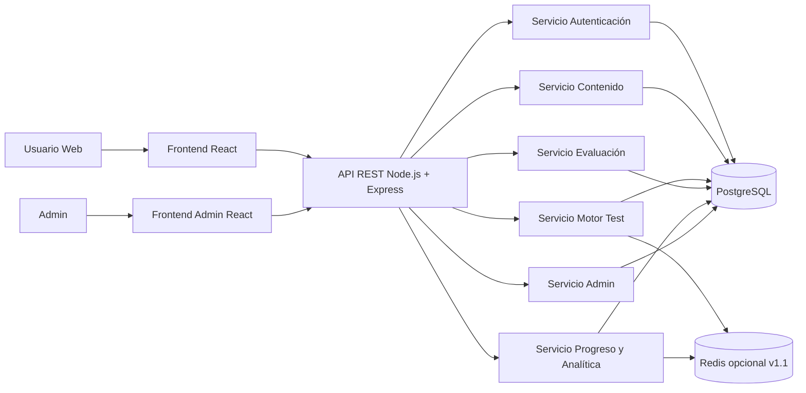

# Arquitectura objetivo v1 (lista para ejecutar)

## 1) Objetivo

Definir una arquitectura **MVP-first** para implementar la plataforma de test de oposiciones con una base sólida para escalar sin sobreingeniería.

Principio guía:

- En v1: monolito modular (backend) + frontend React + PostgreSQL.
- En v2+: desacoplar por dominios (cuando métricas de carga lo justifiquen).

---

## 2) Diagrama lógico (v1)

---

## 3) Componentes y responsabilidades

## 3.1 Backend (Node.js + Express)

Arquitectura interna por capas:

- `routes`: define endpoints y middleware por recurso.
- `controllers`: parseo request/response, sin lógica de negocio.
- `services`: reglas de negocio (motor test, corrección, progreso).
- `repositories`: acceso a PostgreSQL y consultas optimizadas.
- `middleware`: auth JWT, validación, manejo de errores.

Responsabilidades clave:

- autenticación y autorización por rol
- generación de test dinámico
- corrección automática
- cálculo de nota y estadísticas
- endpoints para panel admin

## 3.2 Frontend (React)

Separación recomendada:

- app usuario (`home`, `test`, `resultado`, `progreso`)
- app admin (`dashboard`, `oposiciones`, `materias`, `temas`, `preguntas`, `moderación`)

Responsabilidades clave:

- UX rápida para hacer test (estados: cargando/error/sin datos/completado)
- consumo API vía servicios
- navegación por flujo de estudio y simulacro
- gestión de filtros y paginación en admin

## 3.3 Base de datos (PostgreSQL)

Dominios v1:

- usuarios
- contenido
- test y respuestas
- progreso
- analítica básica
- administración

Tablas núcleo v1:

- `usuarios`
- `oposiciones`, `materias`, `temas`
- `preguntas`, `opciones_respuesta`
- `tests`, `tests_preguntas`, `respuestas_usuario`, `resultados_test`
- `progreso_usuario`
- `reportes_preguntas`

Índices mínimos v1:

- `preguntas(tema_id)`
- `preguntas(nivel_dificultad)`
- `tests(usuario_id, fecha_creacion)`
- `respuestas_usuario(usuario_id, pregunta_id)`

## 3.4 Banco de preguntas

Modelo funcional:

- Oposición → Materia → Tema → Pregunta

Requisitos de calidad:

- pregunta con 4 opciones y una correcta
- explicación asociada
- referencia normativa (si aplica)
- trazabilidad para revisión de contenido

Operativa v1:

- alta/edición manual desde panel
- importación CSV para carga inicial
- moderación por reportes de usuarios

## 3.5 Motor de test

Tipos v1:

- por tema
- por bloque
- simulacro
- refuerzo de falladas

Lógica de selección v1:

- excluir preguntas muy recientes
- priorizar preguntas falladas
- balance de dificultad objetivo: 40% media, 30% fácil, 30% difícil

Lógica de evaluación v1:

- autocorrección al enviar test
- cálculo de aciertos, errores, blancos, nota
- persistencia de resultados e impacto en progreso

## 3.6 Analítica

Métricas v1 (valor directo):

- aciertos/errores/blancos por test
- tiempo medio por test y por tema
- evolución por tema
- histórico de resultados

Decisión técnica:

- almacenar analítica básica en PostgreSQL operativo
- separar almacén analítico solo cuando aumente volumen/consultas complejas

## 3.7 Panel admin

Módulos v1:

- dashboard
- gestión de oposiciones/materias/temas
- gestión de preguntas (CRUD)
- filtros + paginación
- importación CSV
- moderación de reportes
- roles: `admin`, `editor`, `revisor`

---

## 4) Contratos API mínimos (v1)

Autenticación:

- `POST /auth/register`
- `POST /auth/login`

Contenido:

- `GET /oposiciones`
- `GET /materias?oposicion_id=...`
- `GET /temas?materia_id=...`
- `GET /preguntas?tema_id=...`

Motor test:

- `POST /tests/generate`
- `POST /tests/submit`

Analítica/progreso:

- `GET /stats/user`
- `GET /stats/tema`

Admin:

- `POST /preguntas`
- `PUT /preguntas/:id`
- `DELETE /preguntas/:id`
- `GET /admin/reportes-preguntas`

---

## 5) Orden de implementación recomendado

Fase 1 (núcleo funcional):

1. Auth + usuarios
2. Contenido (oposiciones/materias/temas/preguntas)
3. Generación y envío de test
4. Corrección + resultados

Fase 2 (retención):

1. Progreso por tema
2. Test de refuerzo
3. Dashboard de usuario

Fase 3 (operación):

1. Panel admin completo
2. Importador CSV
3. Moderación y revisión

Fase 4 (optimización):

1. Redis para caché y pools
2. Ajuste de queries e índices
3. partición/desacople por dominios si la carga lo exige

---

## 6) Decisiones técnicas cerradas para v1

- Arquitectura objetivo: **monolito modular** (no microservicios en lanzamiento).
- API: **REST** con contratos claros y versionables.
- Persistencia: **PostgreSQL** como fuente única en MVP.
- Rendimiento: optimizar primero con índices y consultas; Redis en segunda iteración.
- Calidad de contenido: flujo editorial con roles y moderación desde panel admin.

---

## 7) Riesgos y mitigación

- Riesgo: lentitud en generación de test con crecimiento de preguntas.
  - Mitigación: índices por tema/dificultad + exclusión de recientes + pools en Redis.

- Riesgo: baja calidad de contenido al escalar importaciones.
  - Mitigación: revisión por roles + reportes + versionado progresivo.

- Riesgo: analítica pesada en base operativa.
  - Mitigación: mantener métricas útiles en v1 y separar analítica avanzada en v2.

---

## 8) Checklist de salida a implementación

- [ ] Estructura backend por capas creada (`routes/controllers/services/repositories`)
- [ ] Esquema SQL v1 migrado con índices mínimos
- [ ] Endpoints de test y corrección operativos
- [ ] Pantallas frontend de test y resultados conectadas
- [ ] Panel admin con CRUD de preguntas + filtros + paginación
- [ ] Métricas de progreso visibles para usuario
- [ ] Seed inicial de preguntas cargado por CSV
